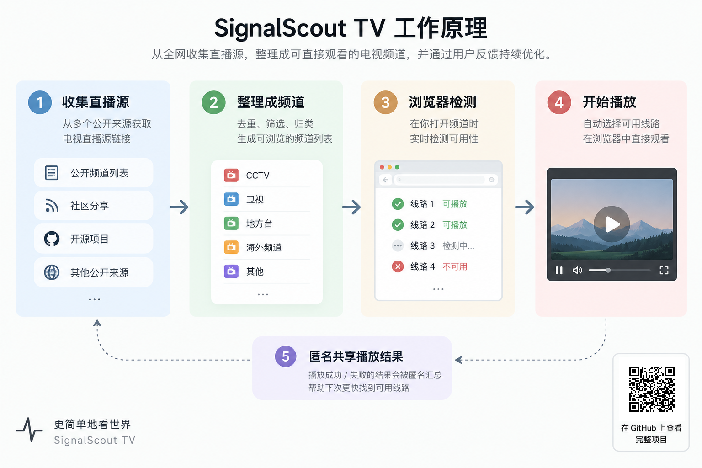
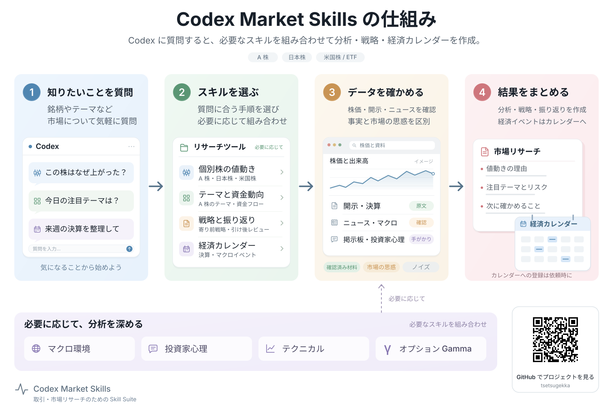
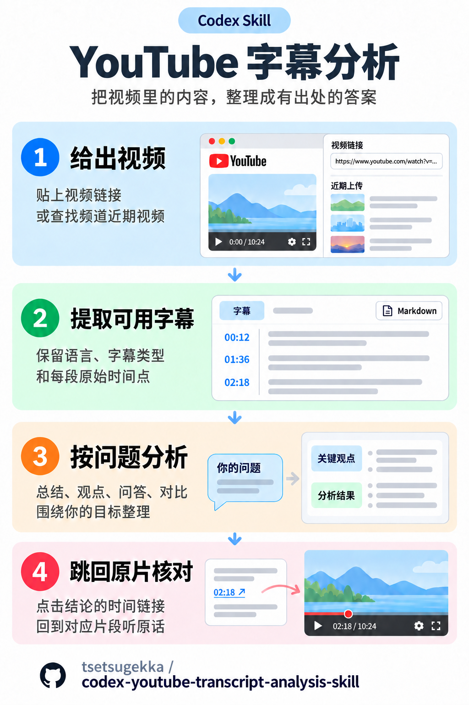

# 軽量インフォグラフィック

製品やワークフローの仕組みを、GitHub README、プレゼン資料、入門ガイドに使える分かりやすい図にします。


[English](README.md) | [简体中文](README.zh-CN.md) | **日本語**

## この Skill について

短い説明、意味を伝える小さなイラスト、淡い配色、明確な接続線で「どう動くのか」を伝える、再利用可能な Codex Skill です。

次の用途に適しています。

- **GitHub リポジトリ：**入力、主要な処理、出力を示す、読みやすい仕組みの説明図。
- **PPT プレゼン：**1 枚のスライドで伝える簡単な構成図、モジュール間の関係、製品の処理フロー。
- **製品ドキュメント：**導入手順、機能紹介、クイックスタートの図解。
- **スマートフォン向け画像投稿：**小紅書などで読みやすい、2:3 の縦長の説明図。

デザインの方向性を保ちながら、配置、アイコン、ステップ数、接続関係を内容に合わせます。詳細な技術仕様書や固定のポスターテンプレートではありません。

## 作例ギャラリー

3 つのプロジェクトを通じて、軽量なデザインを異なる内容や横長・縦長の画面に応用する例を紹介します。画像をクリックすると原図を表示できます。

### SignalScout TV · 製品の処理フロー

配信ソースの収集、チャンネルの整理、ブラウザーでの確認、再生までを、小さな画面イラストで具体的に伝えます。原図は中国語です。

[](https://github.com/tsetsugekka/signalscout-tv/blob/main/public/architecture.png)

[SignalScout TV のリポジトリを見る →](https://github.com/tsetsugekka/signalscout-tv)

### Codex Market Skills · 調査フロー

質問からスキルの選択、根拠の確認を経て調査結果をまとめます。補助的な分析手法を主な流れの下に配置し、全体を読み取りやすくしています。

[](https://github.com/tsetsugekka/codex-market-skills/blob/main/assets/how-it-works.ja.svg)

[Codex Market Skills のリポジトリを見る →](https://github.com/tsetsugekka/codex-market-skills)

これらの既存作例が、本 Skill のデザインの基になっています。新しい図では、構成、イラスト、説明文を実際の内容に合わせて調整します。

### YouTube 字幕分析 · スマートフォン向け縦長図

**2:3 の縦長**作例です。動画の指定、利用可能な字幕の抽出、目的に合わせた分析、元動画の該当箇所の確認を示します。図は中国語で、上から下へ読む短いモジュールと大きめの文字で構成しています。

[](skills/lightweight-infographic/assets/youtube-transcript-analysis.portrait.zh-CN.png)

[YouTube 字幕分析 Skill のリポジトリを見る →](https://github.com/tsetsugekka/codex-youtube-transcript-analysis-skill)

スマートフォン向けの既定比率は 2:3（例：1200 × 1800）で、別の比率も指定できます。横長図の縦横比を逆にする場合は、幅と高さを入れ替えて再配置し、元の図を引き伸ばしません。約 360〜430 ピクセルの表示幅で可読性を確認します。これはデザイン上の既定値であり、投稿先の必須仕様ではありません。スマートフォン向け投稿では QR コードを既定で省略し、プロジェクト名や完全な `owner/repo` を、図と統一感のあるリポジトリ表示欄に配置して出典を示します。QR コードは明示的な依頼がある場合だけ追加します。

```text
$lightweight-infographic を使って、このプロジェクトをスマートフォン向けの
2:3 の縦長図にしてください。上から下へ読む構成にし、文字を読みやすく保ち、
PNG で納品してください。
```

## Skill

| ファイル | 役割 |
|---|---|
| [`lightweight-infographic`](skills/lightweight-infographic/SKILL.md) | 内容の整理、作図、書き出し、確認 |
| [`agents/openai.yaml`](skills/lightweight-infographic/agents/openai.yaml) | Codex の表示情報と呼び出し用プロンプト |

Skill 本文は中国語です。図の言語はユーザーの指定に従います。3 言語の README は紹介文の翻訳であり、別々の Skill ではありません。

## プロンプト例

```text
$lightweight-infographic を使って、このリポジトリの仕組みを図解してください。
README と関連コードを確認し、主要な流れを分かりやすくまとめ、
README に掲載できる PNG と編集可能な SVG を作成してください。
```

```text
$lightweight-infographic を使って、このシステムの説明を 16:9 の PPT 用に
簡単な構成図にしてください。ユーザー、サービス、データストアの関係を示し、
スライドに挿入できる画像を納品してください。
```

```text
$lightweight-infographic を使って、この導入フローの日本語・英語・中国語版を
作成してください。言語ごとに改行を調整し、指定 URL の QR コードを追加して、
書き出した画像から読み取れることを確認してください。
```

## 特徴

- 内容に合う構成を選択。順序のある処理は通常 3〜5 ステップ、構成図は必要に応じて階層や分岐を使用。
- 小さな画面図やイラストで動作を説明し、控えめな色と文字の階層で読みやすく整理。
- 事実と矢印は実際の資料に基づき、参考画像は見た目の参考として使用。
- 表示用の PNG と、必要に応じて実際に編集できる SVG を出力。ネイティブに編集できる PPTX には対応するプレゼン作成ツールが必要。
- QR コードは用途別に判断。スマートフォン向け投稿では既定で省略し、GitHub README・PPT・製品ドキュメントでは、確認済みで共有可能なリポジトリ URL がある場合に既定で追加します。ユーザーの明示的な指定を優先し、実 URL から生成して最終出力の読み取りを確認します。
- 可読性、はみ出し、接続線、多言語の配置、要求された編集可能性を描画結果で確認。

## 推奨構成

```text
README.md
README.zh-CN.md
README.ja.md
skills/
  lightweight-infographic/
    SKILL.md
    agents/openai.yaml
    assets/
      signalscout-tv.png
      youtube-transcript-analysis.portrait.zh-CN.png
      codex-market-skills.zh-CN.png
      codex-market-skills.{zh-CN,en,ja}.svg
      SOURCES.md
```

実行指針、表示用メタデータ、参考画像を同梱しています。作図前に 2 枚の横長 PNG 参考図を開き、スマートフォン向けの場合は縦長の作例も確認します。配色、文字の階層、イラストの密度を学び、配置、アイコン、関係を新しい内容に合わせます。API キーや特定の描画サービスを前提とせず、実際の出力形式は利用可能なツールによって決まります。

## インストールと使い方

Codex のグローバル Skill ディレクトリへコピーします。同名の Skill がある場合は、内容を比較してから置き換えてください。

```sh
git clone https://github.com/tsetsugekka/lightweight-infographic-skill.git
mkdir -p "${CODEX_HOME:-$HOME/.codex}/skills"
cp -R lightweight-infographic-skill/skills/lightweight-infographic "${CODEX_HOME:-$HOME/.codex}/skills/"
```

新しい Codex タスクを開始して、インストールした Skill を検出させます。`$lightweight-infographic` と説明したい内容を入力し、必要ならサイズ、言語、形式を指定してください。ネイティブに編集できる PPTX が必要な場合は明示し、プレゼン作成ツールのある環境を使ってください。

## 安全上のルール

公開は許可された内容に限定し、認証情報、非公開パス、個人メタデータを出力に含めません。作図の依頼だけで、リポジトリの公開、文書の差し替え、既存画像の削除が許可されたことにはなりません。

## 制約

単体の描画ソフトではなく、エージェント向けの指示パッケージです。製品の動作確認を代替せず、未検証の QR コードや、画像を貼り付けただけの編集可能スライドを完成扱いにしません。実施できなかった確認は具体的に報告します。
