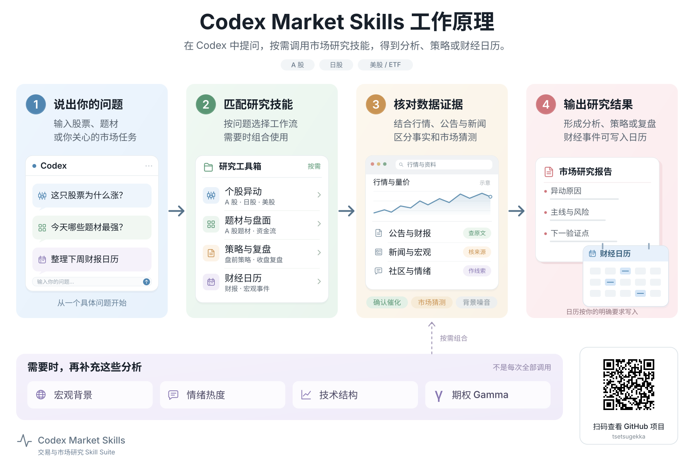

# 轻量信息图

把产品或流程画成简单易懂的说明图，用于 GitHub README、PPT 和入门文档。


[English](README.md) | **简体中文** | [日本語](README.ja.md)

## 这是什么

一个可复用的 Codex Skill：用简短文字、承担解释作用的小插图、柔和配色和清楚的连线，让读者快速看懂“它是怎么工作的”。

适合这些场景：

- **GitHub 仓库：**画一张简单易懂的工作原理图，说明输入、关键步骤和输出。
- **PPT 演示：**在一页里解释简单架构、模块关系或产品流程。
- **产品文档：**制作入门说明、功能介绍和快速上手配图。
- **手机图文：**使用 2:3 竖版画布，制作适合小红书等平台阅读的流程说明图。

延续的是设计语言；版式、图标、步骤数量和关系根据实际内容调整。它不是完整技术架构规格，也不是固定海报模板。

## 效果展示

三个项目示例，展示同一种轻量设计语言如何适配不同内容与横竖画布。点击图片可查看原图。

### SignalScout TV · 产品工作流程

从收集直播源、整理频道，到浏览器检测和播放，用小型界面插图把每个步骤讲具体。

[](https://github.com/tsetsugekka/signalscout-tv/blob/main/public/architecture.png)

[查看 SignalScout TV 仓库 →](https://github.com/tsetsugekka/signalscout-tv)

### Codex Market Skills · 研究工作流程

把一个问题经过技能匹配、证据核对，转化为研究结果。辅助研究方法放在主流程下方，让主线保持清楚。

[](https://github.com/tsetsugekka/codex-market-skills/blob/main/assets/how-it-works.zh-CN.svg)

[查看 Codex Market Skills 仓库 →](https://github.com/tsetsugekka/codex-market-skills)

这些既有示例是本 Skill 的风格来源。绘制新内容时，结构、插图和文字会随实际需求调整。

### YouTube 字幕分析 · 手机竖版

**2:3 竖版**示例：给出视频、提取可用字幕、按问题分析，再跳回原片核对。重新组织为从上到下阅读的短模块，放大文字，保留解释性小插图。

[](skills/lightweight-infographic/assets/youtube-transcript-analysis.portrait.zh-CN.png)

[查看 YouTube 字幕分析 Skill 仓库 →](https://github.com/tsetsugekka/codex-youtube-transcript-analysis-skill)

手机画布默认可选 2:3（如 1200 × 1800），也可指定其他比例。“横纵比反过来”是交换宽高后重新排版，不是拉伸原图。完成后按约 360–430 像素的手机显示宽度检查可读性。这些是设计预设，不是平台上传限制。手机图文默认不加二维码，以项目名或完整 `owner/repo` 标识来源，并设计与整图一致的仓库标识区；只有明确要求时才加入二维码。

```text
使用 $lightweight-infographic，把这个项目画成适合手机图文平台的 2:3 竖版。
把主流程改成从上到下阅读，确保手机上文字清楚，交付 PNG。
```

## Skill 入口

| 入口 | 用途 |
|---|---|
| [`lightweight-infographic`](skills/lightweight-infographic/SKILL.md) | 梳理内容、绘制、导出并检查轻量信息图 |
| [`agents/openai.yaml`](skills/lightweight-infographic/agents/openai.yaml) | Codex 展示信息与默认调用提示 |

Skill 正文使用中文，图中文字按用户要求选择语言；三份 README 是本地化介绍，不是三套独立 Skill。

## 调用示例

```text
使用 $lightweight-infographic，为这个仓库绘制工作原理图。
先读 README 和相关代码，突出容易理解的主流程，
交付适合放进 README 的 PNG 和可编辑 SVG。
```

```text
使用 $lightweight-infographic，把这份系统说明画成适合 16:9 PPT 的
简单架构图，讲清用户、服务和数据存储之间的关系，交付可插入的图片。
```

```text
使用 $lightweight-infographic，为这个入门流程制作中文、英文、日文三版。
分别调整换行，加入指向我提供地址的二维码，并验证最终导出的码。
```

## 主要特点

- 按内容选择结构：顺序流程通常保留 3–5 步，架构关系可用分层或分支。
- 用小型界面和插图解释动作，以克制的配色和文字层级帮助阅读。
- 来源决定事实与箭头，参考图只决定风格。
- PNG 用于直接展示，按需交付真正可编辑的 SVG；原生可编辑 PPTX 需要相应演示文稿工具。
- 二维码按场景决定：手机图文默认不加；GitHub README、PPT 和产品文档在有明确、可分享的仓库地址时默认加仓库二维码。用户明确要求优先；二维码由真实地址生成，并在最终导出图上解码后才报告验证通过。
- 渲染检查覆盖可读性、溢出、连线、多语言排版和所需可编辑性。

## 推荐目录

```text
README.md
README.zh-CN.md
README.ja.md
skills/
  lightweight-infographic/
    SKILL.md
    agents/openai.yaml
    assets/
      signalscout-tv.png
      youtube-transcript-analysis.portrait.zh-CN.png
      codex-market-skills.zh-CN.png
      codex-market-skills.{zh-CN,en,ja}.svg
      SOURCES.md
```

安装包包含执行指引、界面元数据和随包参考图。绘制前须实际打开两张横版 PNG 参考图；手机图文任务另看竖版示例，学习配色、文字层级和图示密度，再按新内容调整布局、图标和关系。不要求 API key 或固定绘图服务；实际导出能力取决于当前环境可用的工具。

## 安装与使用

将 Skill 复制到 Codex 全局技能目录。如果已存在同名 Skill，先比较内容再替换。

```sh
git clone https://github.com/tsetsugekka/lightweight-infographic-skill.git
mkdir -p "${CODEX_HOME:-$HOME/.codex}/skills"
cp -R lightweight-infographic-skill/skills/lightweight-infographic "${CODEX_HOME:-$HOME/.codex}/skills/"
```

新建一个 Codex 任务以发现已安装的 Skill，然后用 `$lightweight-infographic` 加上要解释的内容进行调用。有尺寸、语言或格式偏好时一并说明。如需原生可编辑 PPTX，请明确提出，并使用具备演示文稿工具的环境。

## 安全规则

只公开已获授权的内容，导出文件不包含凭据、私有路径和个人元数据。绘图请求本身不授权发布仓库、替换文档或删除旧图。

## 能力边界

这是指令包，不是独立绘图软件。它不能代替产品事实核对，未解码的二维码不能称为已验证，扁平图片不能称为原生可编辑幻灯片。无法完成的检查须如实说明。
